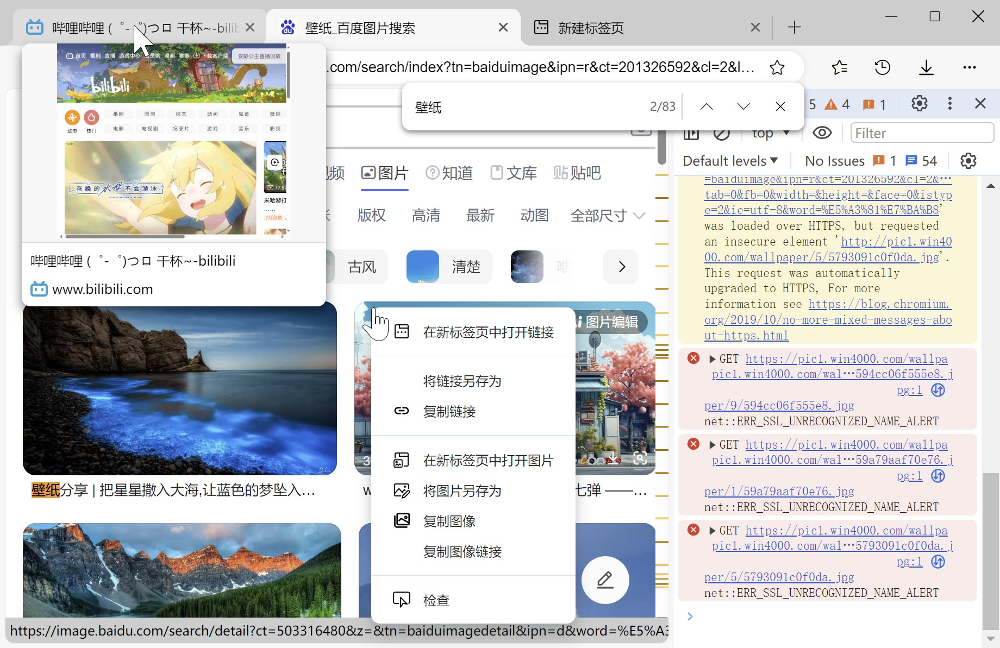

# NW.js 浏览器 Demo

基于 **[NW.js](https://nwjs.io/)** 实现的浏览器 Demo，功能比较简单，还有很多坑，没啥实际用途，仅做学习参考。

纯原生 JS 写的，没有使用开发框架，主要是尝试一下 WebView 的使用，里面用到了 WebView 的大部分特性（具体可以查看 `WebViewExtra.js` 这个模块）。

已实现的一些功能：

- [x] **标签栏**（基于 [chrome-tabs](https://github.com/adamschwartz/chrome-tabs) 实现的仿 Chrome 标签栏）
  - [x] **标签页预览**（显示 WebView 截图）
- [x] **地址栏**
  - [x] 页面导航（返回、前进、刷新、停止）
- [x] **WebView**（显示页面）
  - [x] 打开 **开发者工具**
  - [x] 鼠标移上 `<a>` 标签时显示 **链接预览**
  - [x] 不同类型的元素显示相应的 **右键菜单**
- [x] **查找栏**
- [x] **下载**
  - [x] 下载进度显示
  - [x] 下载列表面板
- [x] **历史记录**
  - [x] 历史记录面板
- [ ] **收藏夹**
  - [ ] 收藏夹面板
  - [ ] **书签栏**

## 使用方法

1. 下载 [NW.js](https://nwjs.io/) 的 SDK 包，把 `package.nw` 放到根目录（和 `nw.exe` 同一级）
4. 启动 `nw.exe`

> **NOTE：** 如果想支持视频播放，还需要替换 `ffmpeg.dll`：https://github.com/nwjs-ffmpeg-prebuilt/nwjs-ffmpeg-prebuilt/releases

## 项目结构

**页面：**

- `index.html` - 主窗口
- `blank.html` - 空白页
- `setting.html` - 设置页

**模块：**

- `index.js` - 主窗口
  - `window.js` - 窗口控制
  - `tabBar.js` - 标签栏（基于 [chrome-tabs](https://github.com/adamschwartz/chrome-tabs) 实现的仿 Chrome 标签栏）
    - `Tab.js` - 标签页组件
    - `tabContextmenu.js` - 标签页右键菜单
    - `tabPreview.js` - 标签页预览
  - `addressBar.js` - 地址栏
    - `appMenu.js` - 应用菜单
  - `findBar.js` - 查找栏
  - `webviews.js` - WebView
    - `WebViewExtra.js` - WebView 封装
    - `DevTools.js` - 开发者工具组件
    - `WebView.js` - WebView + DevTools 组件
    - `webviewContextmenu.js` - WebView 右键菜单
    - `webview_inject.css` - 注入到 WebView 中的 css 样式
    - `webview_inject.js` - 注入到 WebView 中的 js 脚本
    - `hrefPreview.js` - 链接预览
  - `contextmenu.js` - 主窗口右键菜单
  - `shortcut.js` - 快捷键（也会注入到 WebView 中）
  - `downloads.js` - 下载（基于 `chrome.downloads` API 实现）
  - `history.js` - 历史记录（数据保存在 `chrome.storage` 中）
  - `bookmarks.js` - 收藏夹
- `common.js` - 工具函数
- `filePicker.js` - 文件选择器封装
- `PopupBox.js` - 弹出面板组件
- `setting.js` - 设置数据（数据保存在 `chrome.storage` 中）
  - `defaultSetting.json` - 默认设置数据

## PS

> **[NW.js](https://nwjs.io/)** 对 WebView 的修改很少，基本就只加了个 Node 支持，在写这个例子的时候，很多功能都需要通过在 WebView 中注入代码、和 WebView 进行通信来实现，有些功能还没找到解决方案（在源码中搜索 `TODO` 关键词可以找到）。
>
> 如果想写个浏览器的话，更建议用 **[Electron](https://www.electronjs.org/zh/)**，它给 WebView 封装了一些实用的 API。
>
> - **Chrome** webview：https://developer.chrome.com/docs/apps/reference/webviewTag
> - **NW.js** webview：https://nwjs.readthedocs.io/en/latest/References/webview%20Tag/
> - **Electron** webview：https://www.electronjs.org/zh/docs/latest/api/webview-tag

